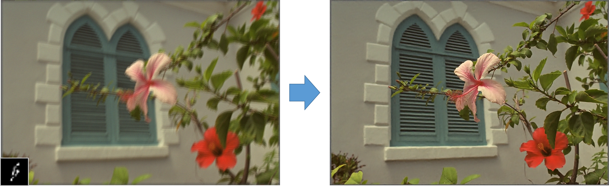
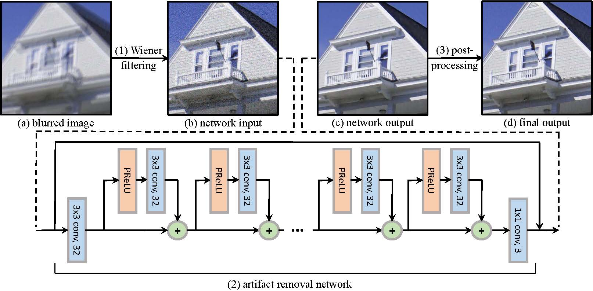

# Introduction
Unoptimized implementation of <b>"Fast Non-blind Deconvolution via Regularized Residual Networks with Long/Short Skip-Connections"</b> in Matlab and Caffe.

This project uses a Convolutional Neural Network (CNN) to improve a performance of non-blind deconvolution. It uses Wiener deconvolution as a pre-deconvolution, and it enables the network to process a general non-blind deconvolution problem by training various blur kernels and noise levels.

For more details regarding this technique, please refer to the paper

* Example
  
  * It requires a blur kernel for a blurred image

* Framework

## How to use it
Requirement: Matlab, CUDA<=7.5, Caffe 
Tested OS: Ubuntu 14.04 
Installation procedure: 

1. build caffe  
$ cd caffe  
-modify parameters and paths in Makefile.config  
$ make all  
$ make matcaffe  
2. set the path of matcaffe in demo.m  
3. run demo.m  
* This code includes only a test function.

## Contributors
Hyeongseok Son (sonhs@postech.ac.kr)

## Citation
Cite our papers if you find this software useful. 
1. Hyeongseok Son, Seungyong Lee, "[Fast Non-blind Deconvolution via Regularized Residual Networks with Long/Short Skip-Connections](http://cg.postech.ac.kr/research/resnet_deconvolution/)", IEEE International Conference on Computational Photography (ICCP) 2017, 2017. 

## About Coupe Project
Project ‘COUPE’ aims to develop software that evaluates and improves the quality of images and videos based on big visual data. To achieve the goal, we extract sharpness, color, composition features from images and develop technologies for restoring and improving by using it. In addition, personalization technology through user preference analysis is under study.

Please checkout out other Coupe repositories in our Posgraph github organization.

## Coupe Project
* [Coupe Website](http://coupe.postech.ac.kr/)
* [POSTECH CG Lab.](http://cg.postech.ac.kr/)

